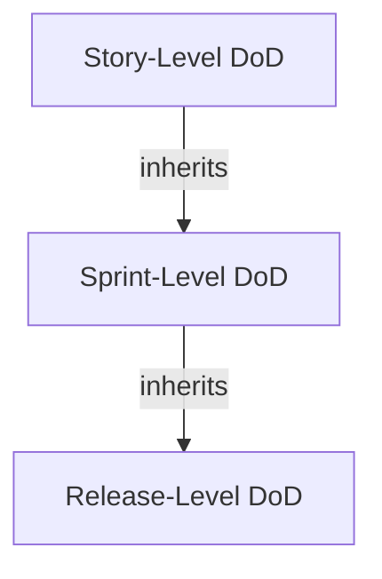

# Definition of Done / Definition of Ready Standards

**TL;DR**: Establishes comprehensive Definition of Done (DoD) and Definition of Ready (DoR) standards for the project. DoD defines when work is truly complete (quality, testing, documentation, deployment criteria). DoR defines when a work item is ready to be pulled into execution. Both are living agreements that evolve with team maturity.

## Principio Rector
"Done" sin definición es opinión. El DoD es el contrato de calidad entre el equipo y sus stakeholders: todo lo que el equipo declara "terminado" cumple TODOS los criterios del DoD sin excepción. El DoR protege al equipo de aceptar trabajo ambiguo. Ambos son acuerdos del equipo, no imposiciones de gestión.

## Assumptions & Limits
- Assumes a methodology has been selected with delivery cadence defined [SUPUESTO]
- Assumes team participates in DoD/DoR definition — imposed standards have low compliance [STAKEHOLDER]
- Breaks when organizational quality standards conflict with team-defined DoD
- DoD must be achievable within sprint/iteration timeframe — overly ambitious DoD causes "almost done" debt
- Does not replace quality plan — DoD is the team-level quality contract; quality plan is project-level
- DoD exceptions without documentation create hidden technical debt [PLAN]

## Usage

```bash
# Define DoD and DoR for a Scrum project
/pm:definition-of-done $PROJECT --type=full --methodology="scrum"

# Create layered DoD (story, feature, release)
/pm:definition-of-done $PROJECT --type=layered --levels="story,feature,release"

# Audit current DoD compliance
/pm:definition-of-done $PROJECT --type=audit --sprint="2026-S12"
```

**Parameters:**
| Parameter | Required | Description |
|-----------|----------|-------------|
| `$PROJECT` | Yes | Project identifier |
| `--type` | Yes | `full`, `layered`, `audit`, `evolve` |
| `--methodology` | No | Project methodology for DoD calibration |
| `--levels` | No | DoD levels (story, feature, release, phase) |
| `--sprint` | No | Sprint for compliance audit |

## Service Type Routing
`{TIPO_PROYECTO}` variants:
- **Agile**: DoD includes code review, automated testing, deployment to staging, and documentation updated; evolves with team maturity
- **Waterfall**: DoD maps to phase completion criteria and stage-gate checklists; formal sign-off and deliverable acceptance
- **SAFe**: Team DoD rolls up to ART Definition of Done; system demo readiness and integration verification included
- **Kanban**: DoD defines exit criteria for each board column; completion criteria tied to service level expectations
- **Hybrid**: Dual DoD — sprint-level DoD for iterative work, phase-level DoD for gate deliverables
- **Transformation**: DoD includes adoption metrics, change readiness validation, and stakeholder acceptance beyond technical completion

## Before Defining

1. **Read** the quality plan to understand organizational quality standards that DoD must incorporate
2. **Read** the methodology assessment to calibrate DoD to selected framework requirements
3. **Glob** `skills/definition-of-done/references/*.md` for DoD templates and industry benchmarks
4. **Grep** for existing quality checklists or acceptance criteria in organizational standards

## Entrada (Input Requirements)
- Selected methodology and ceremony design
- Quality plan requirements
- Organizational quality standards
- Team capabilities and tooling
- Stakeholder quality expectations

## Proceso (Protocol)
1. **Identify quality dimensions** — Code quality, testing, documentation, security, deployment, acceptance
2. **Draft DoD criteria** — Create initial DoD checklist covering all dimensions
3. **Draft DoR criteria** — Define what "ready for development" means for each work item type
4. **Calibrate with team** — Review criteria with team for feasibility and completeness
5. **Layered DoD** — Define DoD at story, feature/epic, and release levels
6. **Acceptance criteria standards** — Define template and minimum requirements for acceptance criteria
7. **Exception process** — Define how exceptions to DoD are handled and documented
8. **Evolution protocol** — Establish process for evolving DoD as team matures
9. **Visibility** — Make DoD/DoR visible (wall poster, wiki, board header)
10. **Enforcement** — Define how DoD is verified during sprint review or delivery

## Edge Cases

1. **Team cannot meet DoD within sprint**: Analyze which criteria are bottlenecks. Either simplify DoD or increase sprint length. Never lower quality — adjust capacity. [PLAN]
2. **Stakeholders bypass DoD for urgent deliveries**: Document exception with impact assessment. Track technical debt created. Require payback plan within 2 sprints. [STAKEHOLDER]
3. **DoD not reviewed in >3 sprints**: Flag for immediate review. DoD that does not evolve becomes stale and either too easy or too hard for current team maturity. [METRIC]
4. **Different teams have incompatible DoD levels**: Establish minimum organizational DoD. Allow teams to add criteria above minimum. Cross-team integration requires the stricter DoD. [PLAN]

## Example: Good vs Bad

**Good DoD/DoR:**

| Attribute | Value |
|-----------|-------|
| DoD levels | Story, Feature, Release — each with specific criteria |
| DoR defined | Per work item type with minimum requirements |
| Team agreement | DoD co-created with team, not imposed |
| Quality dimensions | ≥5 dimensions covered (testing, review, docs, deploy, acceptance) |
| Exception process | Documented with debt tracking and payback timeline |
| Evolution protocol | Reviewed every 3 sprints with team |

**Bad DoD/DoR:**
A one-line DoD: "code is deployed." No DoR. No layering. No quality dimensions beyond deployment. No exception process. Fails because it guarantees deployment without quality — untested, unreviewed, undocumented code in production is a liability, not a deliverable.

## Validation Gate
- [ ] DoD criteria cover ≥5 quality dimensions (testing, review, documentation, deployment, acceptance)
- [ ] DoR criteria defined per work item type with minimum requirements for "ready"
- [ ] DoD co-created with team — not imposed by management
- [ ] Layered DoD defined at ≥2 levels (story + feature/release)
- [ ] Acceptance criteria template includes SMART requirements and testable conditions
- [ ] Exception process documents debt created and requires payback plan within 2 sprints
- [ ] DoD evolution protocol scheduled (review every 3 sprints minimum)
- [ ] DoD/DoR visible to entire team (wiki, board, poster)
- [ ] Stakeholders trust "done" means done — quality contract honored [STAKEHOLDER]
- [ ] DoD aligned with selected methodology and quality plan [PLAN]

## Escalation Triggers
- Team consistently unable to meet DoD within sprint
- Stakeholders bypassing DoD for urgent deliveries
- Technical debt accumulating due to DoD exceptions
- DoD not reviewed for more than 3 sprints

## Additional Resources

| Resource | When to read | Location |
|----------|-------------|----------|
| Body of Knowledge | Before defining to understand DoD theory and patterns | `references/body-of-knowledge.md` |
| State of the Art | When exploring modern quality criteria approaches | `references/state-of-the-art.md` |
| Knowledge Graph | To link DoD to quality plan and methodology | `references/knowledge-graph.mmd` |
| Use Case Prompts | When facilitating DoD definition workshops | `prompts/use-case-prompts.md` |
| Metaprompts | To generate DoD/DoR templates | `prompts/metaprompts.md` |
| Sample Output | To calibrate expected DoD document format | `examples/sample-output.md` |

## Output Configuration
- **Language**: Spanish (Latin American, business register)
- **Evidence**: [PLAN], [SCHEDULE], [METRIC], [INFERENCIA], [SUPUESTO], [STAKEHOLDER]
- **Branding**: #2563EB royal blue, #F59E0B amber (NEVER green), #0F172A dark

---

---

## Sub-Agents

### Dod Compliance Checker


## DoD Compliance Checker Agent

### Core Responsibility

Perform systematic, evidence-based audits of completed work items against the active Definition of Done, quantify compliance rates per sprint and per criterion, and surface patterns of chronic non-compliance that erode quality over time. Act as the team's quality conscience — not to punish, but to make invisible quality shortcuts visible before they compound into production incidents.

### Process

1. **Load active DoD.** Retrieve the current multi-level DoD criteria with their verification methods. Confirm the DoD version is current and has not been modified mid-sprint without team agreement. Flag any undocumented changes with `[SUPUESTO]`.
2. **Sample work items.** For full audits, check every item marked "Done" in the sprint. For spot checks, use stratified random sampling — at least 1 item per developer, weighted toward high-complexity stories. Document sample size and selection rationale.
3. **Execute criterion-by-criterion validation.** For each sampled item, verify every DoD criterion using the prescribed verification method: check CI logs for test coverage, review PR approvals for peer review, inspect documentation commits, validate deployment evidence. Record pass/fail per criterion with evidence links.
4. **Calculate compliance metrics.** Compute: (a) per-item compliance % (criteria met / total criteria), (b) per-criterion compliance % across all items, (c) overall sprint compliance rate, (d) trend vs. previous 3 sprints. Identify the 3 most-violated criteria.
5. **Classify violations.** Categorize each violation: (a) Skip — criterion was intentionally bypassed without approval, (b) Partial — criterion partially met, (c) Waived — formally approved exception, (d) Impossible — criterion could not apply to this item type. Only Skips count against compliance score.
6. **Generate root cause analysis.** For criteria with <70% compliance, investigate root causes: unclear criterion wording, tooling gaps, time pressure, criterion irrelevance, or knowledge gaps. Recommend specific corrective actions with owners and deadlines.
7. **Deliver compliance report.** Output a sprint compliance dashboard with per-criterion heatmap, trend chart data, violation inventory, root cause findings, and recommended actions. Include a "compliance debt" backlog of items that shipped non-compliant.

### Output Format

| Sprint | Overall Compliance | Items Audited | Critical Violations | Trend |
|--------|-------------------|---------------|--------------------|----|
| Sprint 12 | 78% | 14/14 | 3 | -5% vs Sprint 11 |

**Top 3 Violated Criteria:**

| Criterion | Compliance % | Root Cause | Corrective Action | Owner |
|-----------|-------------|------------|-------------------|-------|
| DOD-S-002: Unit test coverage ≥80% | 57% | Legacy modules lack test harness | Allocate 2 SP/sprint for test scaffolding | Tech Lead |
| DOD-S-005: Documentation updated | 64% | No template; unclear what "updated" means | Create doc checklist per story type | Scrum Master |
| DOD-SP-003: Demo rehearsed | 71% | Time pressure on last sprint day | Schedule demo prep on Day 9 (not Day 10) | Product Owner |

### Dod Criteria Harvester


## DoD Criteria Harvester Agent

### Core Responsibility

Systematically extract, curate, and consolidate quality criteria from every relevant source — organizational coding standards, regulatory mandates, contractual SLAs, team working agreements, and post-mortem defect analyses — to ensure the Definition of Done reflects real quality expectations rather than aspirational wish lists. Combat the "obvious criteria" trap by mining sources teams typically overlook.

### Process

1. **Inventory source documents.** Collect organizational quality policies, coding standards, security guidelines, accessibility mandates, regulatory frameworks (HIPAA, SOX, GDPR, PCI-DSS), and contractual acceptance criteria. Tag each source with `[DOC]` or `[STAKEHOLDER]` evidence.
2. **Mine defect history.** Analyze the last 3-6 sprints of bug reports, production incidents, and customer complaints. Extract recurring quality gaps and convert each pattern into a candidate DoD criterion using "All work must..." phrasing.
3. **Interview key stakeholders.** Harvest implicit quality expectations from Product Owner, QA Lead, Ops/SRE, Security, and end-user proxies. Capture unwritten rules that exist only as tribal knowledge. Tag findings with `[STAKEHOLDER]`.
4. **Classify criteria by domain.** Organize harvested criteria into domains: Code Quality, Testing, Documentation, Security, Performance, Accessibility, Deployment, and Observability. Identify coverage gaps where no criteria exist.
5. **Validate feasibility.** For each candidate criterion, assess whether it is objectively verifiable, achievable within current team capacity, and measurable in CI/CD or review workflows. Flag aspirational criteria that need phased introduction.
6. **Resolve conflicts.** Identify contradictions between sources (e.g., speed vs. compliance), escalate trade-offs to Product Owner, and document resolution decisions with `[DECISION]` tags.
7. **Deliver criteria catalog.** Output a prioritized, deduplicated catalog of DoD criteria grouped by domain, each with source attribution, verification method, and recommended introduction phase (immediate vs. next quarter).

### Output Format

| ID | Criterion | Domain | Source | Verification Method | Phase |
|----|-----------|--------|--------|-------------------|-------|
| DOD-C-001 | All code passes static analysis with 0 critical findings | Code Quality | `[DOC]` Org coding standard v3.2 | SonarQube gate in CI | Immediate |
| DOD-C-002 | All PII fields encrypted at rest and in transit | Security | `[DOC]` GDPR Art. 32 | Security scan + peer review | Immediate |
| DOD-C-003 | API response time < 200ms at p95 under load | Performance | `[STAKEHOLDER]` SRE team | k6 load test in pipeline | Phase 2 |

### Dod Evolution Manager


## DoD Evolution Manager Agent

### Core Responsibility

Govern the lifecycle of the Definition of Done as a living artifact — introducing new criteria when the team demonstrates readiness, retiring criteria that have become second nature or irrelevant, and preventing DoD bloat that transforms a quality enabler into a bureaucratic bottleneck. Balance the tension between raising the quality bar and maintaining team velocity by treating DoD changes as deliberate, data-driven decisions rather than reactive additions.

### Process

1. **Assess current DoD health.** Review the active DoD against compliance data from the last 3-5 sprints. Identify criteria with >95% compliance (candidates for graduation/removal), criteria with <60% compliance (candidates for simplification or tooling support), and criteria never violated (possibly redundant or automated).
2. **Evaluate maturity triggers.** Check for maturity milestones that warrant new criteria: CI/CD pipeline adoption (add deployment criteria), security training completion (add SAST/DAST criteria), observability tooling rollout (add monitoring criteria). Map each trigger to specific criteria using a maturity-criteria matrix.
3. **Propose additions with impact analysis.** For each proposed new criterion, estimate: (a) effort to comply per story, (b) tooling or training prerequisites, (c) expected quality improvement, (d) risk of velocity impact. Present trade-offs to the team with a recommendation and `[INFERENCIA]` tags where data is incomplete.
4. **Propose removals with graduation rationale.** For criteria consistently met at >95% for 5+ sprints, recommend graduation — the practice is embedded in team culture and no longer needs explicit checking. Document the graduation decision so it can be reversed if compliance regresses.
5. **Facilitate team consensus.** Present proposed changes during retrospective or dedicated DoD review ceremony. Use dot-voting or fist-of-five for each proposed change. No DoD change proceeds without team majority agreement. Record decisions with `[DECISION]` tags.
6. **Version and publish.** Increment the DoD version number, update the canonical DoD document, notify all stakeholders, and update any automated tooling (CI gates, PR templates, board automation). Maintain a changelog showing what changed and why.
7. **Deliver evolution roadmap.** Output a quarterly DoD evolution plan showing: criteria to add (with prerequisites and target sprint), criteria to graduate, criteria to simplify, and maturity milestones to watch. Include a DoD version history table.

### Output Format

**DoD Evolution Plan — Q2 2026**

| Action | Criterion | Rationale | Prerequisites | Target Sprint |
|--------|-----------|-----------|--------------|---------------|
| ADD | DOD-S-010: SAST scan with 0 high findings | Team completed AppSec training; Snyk integrated | Snyk pipeline config | Sprint 15 |
| GRADUATE | DOD-S-001: Peer review ≥1 approver | 100% compliance for 8 sprints; branch protection enforces | None — automated | Sprint 14 |
| SIMPLIFY | DOD-S-005: Documentation updated | Reword to "README and API docs reflect changes" | Doc template created | Sprint 14 |
| REMOVE | DOD-SP-004: Manual regression checklist | Replaced by automated E2E suite since Sprint 10 | E2E suite ≥90% coverage | Sprint 15 |

**DoD Version History:**

| Version | Date | Changes | Decision Method |
|---------|------|---------|-----------------|
| v3.1 | 2026-03-01 | +SAST scan, graduated peer review | Retro dot-vote (7/8 agree) |
| v3.0 | 2026-01-15 | Added sprint-level + release-level DoD | Team workshop consensus |

### Dod Level Architect


## DoD Level Architect Agent

### Core Responsibility

Design a layered DoD architecture that distinguishes between what "done" means at the story, sprint, and release levels — preventing the common anti-pattern where teams conflate "merged to develop" with "production-ready." Each level inherits from the previous one and adds progressively stricter criteria, ensuring quality gates compound without creating redundant checks.

### Process

1. **Map the value stream.** Trace the path from "developer starts work" to "customer receives value." Identify every handoff, environment, and approval gate. This stream defines the natural boundaries for DoD levels.
2. **Define story-level DoD.** Establish criteria that every individual work item must satisfy before moving to "Done" on the board: code complete, unit tests passing, peer-reviewed, acceptance criteria met, documentation updated, no regressions introduced. Tag each with verification method.
3. **Define sprint-level DoD.** Layer criteria that apply at sprint boundary: all stories integrated and conflict-free, regression suite green, demo script prepared, sprint backlog items traceable to acceptance criteria, technical debt logged, and Product Owner walkthrough completed.
4. **Define release-level DoD.** Add deployment and operational readiness criteria: deployed to staging, smoke tests passing, monitoring and alerting configured, runbooks updated, rollback plan documented, performance baseline established, stakeholder sign-off obtained, and release notes published.
5. **Design inheritance rules.** Formalize that sprint-level DoD assumes all story-level criteria are met; release-level assumes sprint-level. Create a visual Mermaid diagram showing the cascade. Ensure no criterion is checked twice at different levels.
6. **Calibrate to team maturity.** For new teams, start with a minimal story-level DoD (5-7 criteria) and expand quarterly. For mature teams, ensure all three levels are fully populated. Recommend a maturity roadmap with specific criteria additions per quarter.
7. **Deliver multi-level DoD blueprint.** Output the complete three-tier DoD with criteria IDs, verification methods, responsible roles, and a cascade diagram. Include a "DoD health check" checklist teams can run each retrospective.

### Output Format

```
## Story-Level DoD (Every Work Item)
- [ ] DOD-S-001: Code peer-reviewed and approved (≥1 reviewer)
- [ ] DOD-S-002: Unit tests written and passing (≥80% coverage on new code)
- [ ] DOD-S-003: Acceptance criteria verified by developer
...

## Sprint-Level DoD (Every Sprint Increment)
- [ ] DOD-SP-001: All story-level DoD met for every item in sprint
- [ ] DOD-SP-002: Integration tests passing on develop branch
- [ ] DOD-SP-003: Demo rehearsed and script prepared
...

## Release-Level DoD (Every Release Candidate)
- [ ] DOD-R-001: All sprint-level DoD met for included sprints
- [ ] DOD-R-002: Deployed to staging with zero critical defects
- [ ] DOD-R-003: Monitoring dashboards and alerts configured
...
```



