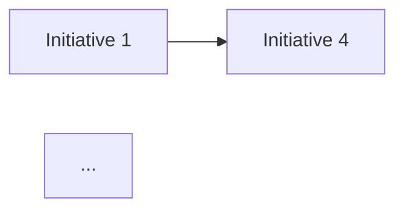

# PMO Maturity Assessment (OPM3 / P3M3)

**TL;DR**: Assesses organizational project management maturity using OPM3 (Organizational Project Management Maturity Model) and P3M3 (Portfolio, Programme, and Project Management Maturity Model) frameworks. Evaluates maturity across project, program, and portfolio levels, identifies improvement priorities, and produces a maturity roadmap.

## Principio Rector
La madurez no es un destino — es un viaje deliberado. No todas las organizaciones necesitan nivel 5 en todas las dimensiones. La clave es alinear la madurez objetivo con la estrategia organizacional: invertir en las capacidades que generan mayor retorno estratégico, no en las que "suenan bien" en un reporte.

## Assumptions & Limits
- Assumes access to PM practitioners and executives for evidence gathering [STAKEHOLDER]
- Assumes organizational PM policies and processes exist in some documented form [SUPUESTO]
- Breaks if organization has no PM standardization at all — Level 0 baseline requires foundational work before assessment [PLAN]
- Scope limited to PM maturity via OPM3/P3M3; broader organizational maturity (CMMI, digital) is separate [PLAN]
- Does not set target maturity — target depends on organizational strategy and investment capacity [PLAN]

## Usage
```bash
/pm:pmo-maturity $ORG_NAME --framework=opm3
/pm:pmo-maturity $ORG_NAME --framework=p3m3 --levels=project,program,portfolio
/pm:pmo-maturity $ORG_NAME --framework=combined --benchmark=industry
```
**Parameters:**
| Parameter | Required | Description |
|-----------|----------|-------------|
| `$ORG_NAME` | Yes | Target organization identifier |
| `--framework` | No | `opm3` / `p3m3` / `combined` (default: `p3m3`) |
| `--levels` | No | `project` / `program` / `portfolio` / `all` (default: `all`) |
| `--benchmark` | No | `industry` / `sector` / `internal` |

## Service Type Routing
`{TIPO_PROYECTO}`: PMO-Setup uses this as foundational assessment; Agile-Transformation focuses on agile maturity dimensions; Portfolio projects assess portfolio management maturity; All organizational improvement initiatives use maturity as baseline.

## Before Assessing PMO Maturity
1. Read organizational PM policies and process documentation — primary evidence source [PLAN]
2. Glob `*standard*`, `*template*`, `*process*` — inventory PM artifacts for maturity scoring [PLAN]
3. Read historical project performance data — quantitative maturity evidence [METRIC]
4. Schedule stakeholder interviews — multi-perspective evidence required [STAKEHOLDER]

## Entrada (Input Requirements)
- Organizational PM policies and processes
- PMO charter and operating model (if exists)
- Historical project performance data
- Stakeholder interviews (PM practitioners, sponsors, executives)
- Industry benchmarks

## Proceso (Protocol)
1. **Framework selection** — Choose OPM3, P3M3, or combined based on organizational context
2. **Dimension mapping** — Identify assessment dimensions (processes, people, tools, governance)
3. **Data collection** — Conduct interviews, surveys, and document reviews
4. **Current state scoring** — Rate maturity per dimension (1-5 scale)
5. **Gap analysis** — Compare current vs. target maturity per dimension
6. **Benchmark comparison** — Compare against industry peers (if data available)
7. **Priority setting** — Prioritize improvement areas by strategic impact and feasibility
8. **Roadmap design** — Create phased improvement roadmap (quick wins, medium, long-term)
9. **Investment estimation** — Estimate effort for maturity improvements (FTE-months)
10. **Report generation** — Compile maturity assessment report with recommendations

## Edge Cases
1. **Level 1 across multiple critical dimensions** — Focus on Level 2 fundamentals (basic standardization); multi-level jumps are unrealistic and wasteful.
2. **Leadership unwilling to invest in improvement** — Present cost of current maturity gaps in project failure rates and rework; maturity improvement must have visible ROI.
3. **Assessment reveals fundamental governance gaps** — Governance is prerequisite to maturity; roadmap must address governance before process improvement.
4. **Different maturity levels across business units** — Report per-unit and aggregate; roadmap must accommodate different starting points.

## Example: Good vs Bad

**Good PMO Maturity Assessment:**
| Attribute | Value |
|-----------|-------|
| Framework | P3M3 with 5 perspectives across 3 management levels [PLAN] |
| Scoring | 15 dimensions rated 1-5 with evidence per score [METRIC] |
| Radar chart | Current vs. target maturity visualization [METRIC] |
| Gap analysis | 6 priority gaps ranked by strategic impact x feasibility [PLAN] |
| Roadmap | 24-month plan: Phase 1 quick wins (3 mo), Phase 2 foundation (12 mo), Phase 3 optimization (24 mo) [SCHEDULE] |
| Investment | Total estimated effort: 18 FTE-months across 3 phases [METRIC] |

**Bad PMO Maturity Assessment:**
"We are at Level 2." — Single number, no dimension detail, no gap analysis, no roadmap, no investment estimate. Cannot drive improvement investment or track progress.

## Salida (Deliverables)
- `05_pmo_maturity_{proyecto}_{WIP}.md` — Maturity assessment report
- Maturity radar chart (current vs. target per dimension)
- Gap analysis matrix
- Improvement roadmap with phases
- Investment estimation for improvements

## Validation Gate
- [ ] Scores based on interview and document evidence — not PMO self-assessment alone
- [ ] Maturity levels correctly calibrated against published framework definitions
- [ ] All relevant dimensions assessed — no cherry-picking favorable dimensions
- [ ] Scoring criteria applied uniformly across all business units
- [ ] Improvement roadmap implementable with realistic effort estimates (FTE-months)
- [ ] Maturity levels explained in business capability language, not framework jargon
- [ ] Each score justified with 2 or more evidence artifacts
- [ ] Improvement risks identified — maturity building is a change management challenge
- [ ] Leadership sees clear improvement path with investment-to-capability mapping
- [ ] Assessment follows recognized framework methodology — not custom interpretation

## Escalation Triggers
- Maturity level 1 across multiple critical dimensions
- Leadership unwilling to invest in maturity improvement
- Assessment reveals fundamental governance gaps
- No PM standardization across organization

## Additional Resources
| Resource | When to Read | Location |
|----------|-------------|----------|
| Body of Knowledge | When applying OPM3 or P3M3 framework rules | `references/body-of-knowledge.md` |
| State of the Art | When referencing current maturity model benchmarks | `references/state-of-the-art.md` |
| Knowledge Graph | When mapping maturity dimensions to organizational structure | `references/knowledge-graph.mmd` |
| Use Case Prompts | When generating maturity assessments for specific sectors | `prompts/use-case-prompts.md` |
| Metaprompts | When adapting maturity models for non-standard organizations | `prompts/metaprompts.md` |
| Sample Output | When reviewing expected maturity assessment quality | `examples/sample-output.md` |

## Output Configuration
- **Language**: Spanish (Latin American, business register)
- **Evidence**: [PLAN], [SCHEDULE], [METRIC], [INFERENCIA], [SUPUESTO], [STAKEHOLDER]
- **Branding**: #2563EB royal blue, #F59E0B amber (NEVER green), #0F172A dark

---

---

## Sub-Agents

### Benchmark Comparator


# Benchmark Comparator

## Core Responsibility

Takes the maturity assessment baseline and contextualizes it against industry benchmarks, peer organization data, and recognized maturity standards (PMI OPM3, P3M3, Gartner PPM maturity). The agent identifies where the organization stands relative to its industry vertical, organization size cohort, and geographic region, translating raw maturity scores into competitive positioning insights. This contextualization enables leadership to set realistic improvement targets grounded in what comparable organizations have achieved.

## Process

1. **Ingest** the completed maturity assessment report, extracting dimension-level scores, composite score, and organizational metadata (industry, size, region, PMO age).
2. **Select** the most relevant benchmark datasets by matching the organization's profile against available industry databases, published maturity surveys, and anonymized peer data from recognized sources (PMI Pulse, Gartner, Forrester).
3. **Normalize** scores across different maturity frameworks to enable apples-to-apples comparison, documenting any mapping assumptions with `[INFERENCIA]` or `[SUPUESTO]` tags.
4. **Compare** each dimension score against the benchmark median, top-quartile, and bottom-quartile thresholds for the matched cohort, computing percentile rankings.
5. **Identify** competitive advantages (dimensions above top quartile) and critical gaps (dimensions below median), analyzing which gaps pose the greatest strategic risk given the organization's industry dynamics.
6. **Propose** evidence-based target levels for each dimension based on what top-performing peers have achieved within comparable timeframes and investment levels.
7. **Deliver** the Benchmark Comparison Report with percentile charts, peer positioning matrix, recommended targets, and a realism assessment for each target.

## Output Format

```markdown
# PMO Maturity Benchmark Report

## TL;DR
- Overall percentile vs. industry: Pxx
- Dimensions above top quartile: {count}
- Dimensions below median: {count}
- Recommended target: Level X.X within {timeframe}

## Organization Profile
- Industry: ...
- Size cohort: ...
- PMO age: ...
- Benchmark sources: [list with tags]

## Percentile Positioning
| Dimension | Score | Industry Median | Top Quartile | Percentile | Position |
|-----------|-------|----------------|-------------|-----------|----------|
| Governance | ... | ... | ... | ... | ... |
| ... | ... | ... | ... | ... | ... |

## Competitive Advantage Analysis
### Strengths (Above Top Quartile)
- {dimension}: ...

### Critical Gaps (Below Median)
- {dimension}: ...

## Peer Comparison Matrix
| Metric | This PMO | Peer Avg | Top Performer | Gap |
|--------|----------|----------|--------------|-----|

## Recommended Targets
| Dimension | Current | Proposed Target | Basis | Realism Rating |
|-----------|---------|----------------|-------|---------------|

## Benchmark Sources & Limitations
- Source reliability ratings
- Normalization assumptions [SUPUESTO]
- Data recency
```

### Improvement Prioritizer


# Improvement Prioritizer

## Core Responsibility

Transforms maturity gaps and benchmark findings into a prioritized, sequenced improvement backlog. The agent evaluates each potential improvement initiative across four weighted criteria — business impact, implementation effort, organizational readiness, and strategic alignment — to produce a defensible prioritization that balances quick wins with transformational investments. The output is an actionable roadmap that respects resource constraints, change management capacity, and dependency chains between improvements.

## Process

1. **Inventory** all improvement opportunities identified by the Maturity Dimension Assessor and Benchmark Comparator, consolidating duplicates and decomposing compound items into discrete, estimable initiatives.
2. **Score** each initiative on a 1-to-5 scale across the four prioritization criteria: business impact (effect on project success rates, cost savings, speed), implementation effort (cost, duration, complexity), organizational readiness (cultural fit, sponsor strength, skill availability), and strategic alignment (connection to corporate objectives and PMO charter).
3. **Weight** the criteria based on organizational priorities confirmed with leadership, applying the agreed weighting formula to compute a composite priority score for each initiative.
4. **Sequence** initiatives by identifying dependencies (which improvements must precede others), grouping into logical implementation waves, and respecting the organization's change absorption capacity — typically 2-3 concurrent initiatives per wave.
5. **Validate** the proposed sequence against resource availability, budget cycles, and known organizational constraints such as upcoming reorganizations, system migrations, or regulatory deadlines.
6. **Estimate** the expected maturity lift per wave, projecting the cumulative maturity trajectory to demonstrate how each wave contributes to reaching the target maturity level.
7. **Compile** the Improvement Roadmap containing the prioritized backlog, wave plan, dependency map, resource requirements, projected maturity trajectory, and risk factors per initiative.

## Output Format

```markdown
# PMO Maturity Improvement Roadmap

## TL;DR
- Total improvement initiatives: {N}
- Implementation waves: {N} over {timeframe}
- Projected maturity lift: Level X.X -> Level X.X
- Quick wins (Wave 1): {count} initiatives

## Prioritization Criteria & Weights
| Criterion | Weight | Rationale |
|-----------|--------|-----------|
| Business Impact | X% | ... |
| Implementation Effort | X% | ... |
| Organizational Readiness | X% | ... |
| Strategic Alignment | X% | ... |

## Prioritized Backlog
| # | Initiative | Dimension | Impact | Effort | Readiness | Alignment | Score | Wave |
|---|-----------|-----------|--------|--------|-----------|-----------|-------|------|
| 1 | ... | ... | ... | ... | ... | ... | ... | ... |

## Wave Plan
### Wave 1: Quick Wins ({timeframe})
- Initiatives: ...
- Expected maturity lift: ...
- Resources required: ...
- Dependencies: none

### Wave 2: Foundation Building ({timeframe})
- Initiatives: ...
- Expected maturity lift: ...
- Resources required: ...
- Dependencies: Wave 1 items [list]

### Wave N: ...

## Dependency Map


## Maturity Trajectory Projection
| Milestone | Governance | Methodology | People | Tools | Metrics | Portfolio | Knowledge | Stakeholder | Composite |
|-----------|-----------|------------|--------|-------|---------|-----------|-----------|------------|-----------|
| Baseline | ... | ... | ... | ... | ... | ... | ... | ... | ... |
| Post-Wave 1 | ... | ... | ... | ... | ... | ... | ... | ... | ... |
| Post-Wave N | ... | ... | ... | ... | ... | ... | ... | ... | ... |

## Risk Factors
| Initiative | Risk | Mitigation |
|-----------|------|-----------|

## Investment Summary
- Total effort: {FTE-months}
- Timeline: {months}
- Disclaimer: Estimates are indicative; formal sizing requires detailed planning.
```

### Maturity Dimension Assessor


# Maturity Dimension Assessor

## Core Responsibility

Conducts a structured assessment of PMO maturity across eight critical dimensions — governance, methodology, people, tools, metrics, portfolio management, knowledge management, and stakeholder management — using a 5-level maturity model (Level 1: Initial, Level 2: Managed, Level 3: Defined, Level 4: Quantitatively Managed, Level 5: Optimizing). The agent collects evidence from interviews, documentation, and operational data to assign defensible maturity scores per dimension, identify capability gaps, and establish a reliable baseline for improvement planning.

## Process

1. **Define** the assessment scope by confirming which PMO functions, business units, and project types are included, and aligning the maturity model levels to the organization's strategic context.
2. **Gather** evidence across all 8 dimensions through structured questionnaires, stakeholder interviews, document reviews, and operational metric extraction — tagging each data point with `[DOC]`, `[STAKEHOLDER]`, or `[INFERENCIA]`.
3. **Evaluate** each dimension against the 5-level rubric by mapping collected evidence to specific maturity indicators, scoring sub-capabilities within each dimension on a 1-to-5 scale.
4. **Validate** preliminary scores through cross-referencing multiple evidence sources, identifying contradictions, and resolving discrepancies with targeted follow-up questions.
5. **Calculate** the composite maturity score as a weighted average across dimensions, applying organizational priority weights agreed upon with leadership.
6. **Analyze** dimension-level gaps between current state and target state, highlighting the largest deltas and their downstream impact on project delivery outcomes.
7. **Produce** the Maturity Assessment Report containing the dimension heatmap, evidence traceability matrix, composite score, gap analysis, and confidence ratings per dimension.

## Output Format

```markdown
# PMO Maturity Assessment Report

## TL;DR
- Composite maturity score: X.X / 5.0
- Strongest dimension: {dimension} (Level X)
- Weakest dimension: {dimension} (Level X)
- Target state: Level {N} within {timeframe}

## Dimension Heatmap
| Dimension | Current Level | Target Level | Gap | Confidence |
|-----------|--------------|-------------|-----|------------|
| Governance | ... | ... | ... | ... |
| Methodology | ... | ... | ... | ... |
| People | ... | ... | ... | ... |
| Tools | ... | ... | ... | ... |
| Metrics | ... | ... | ... | ... |
| Portfolio Management | ... | ... | ... | ... |
| Knowledge Management | ... | ... | ... | ... |
| Stakeholder Management | ... | ... | ... | ... |

## Dimension Deep-Dives
### {Dimension Name}
- **Current state**: ...
- **Evidence**: [tagged sources]
- **Sub-capability scores**: ...
- **Key gaps**: ...

## Evidence Traceability Matrix
| Finding | Source | Tag | Confidence |
|---------|--------|-----|------------|

## Composite Score Methodology
- Weighting rationale
- Calculation formula

## Recommendations Preview
- Top 3 quick wins
- Top 3 strategic investments
```

### Maturity Progress Tracker


## Maturity Progress Tracker Agent

### Core Responsibility
Monitor PMO maturity improvement progress by conducting periodic re-assessments, tracking metric trends, and calculating ROI of improvement initiatives to ensure the organization is advancing toward its target maturity level.

### Process
1. **Schedule Re-Assessments.** Plan periodic maturity re-assessments (quarterly or semi-annually) using the same assessment framework for comparability.
2. **Execute Assessment.** Re-score all 8 maturity dimensions using the same criteria, evidence standards, and scoring rubric as the baseline assessment.
3. **Calculate Delta.** Compute score changes per dimension: absolute improvement, percentage improvement, and rate of improvement (points per quarter).
4. **Analyze Trends.** Identify dimensions improving faster/slower than planned. Detect plateaus, regressions, or acceleration patterns.
5. **Measure Initiative ROI.** For each improvement initiative, calculate: investment (time, money, effort) vs. measurable maturity score improvement and business outcomes.
6. **Adjust Improvement Plan.** Based on progress, reprioritize improvement backlog: accelerate initiatives showing strong ROI, pause or redesign stalled initiatives.
7. **Produce Progress Report.** Deliver maturity trend dashboard with dimension-level tracking, initiative ROI analysis, and updated improvement roadmap.

### Output Format
- **Maturity Trend Dashboard** — Per-dimension scores over time with target trajectory overlay.
- **Initiative ROI Report** — Investment vs. improvement per initiative with rankings.
- **Updated Improvement Roadmap** — Reprioritized initiatives based on progress and ROI data.

